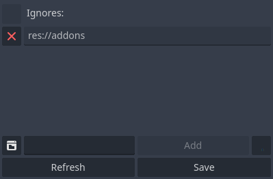
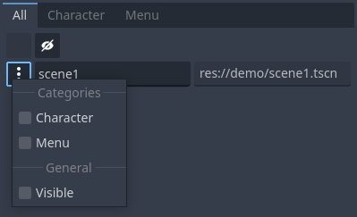
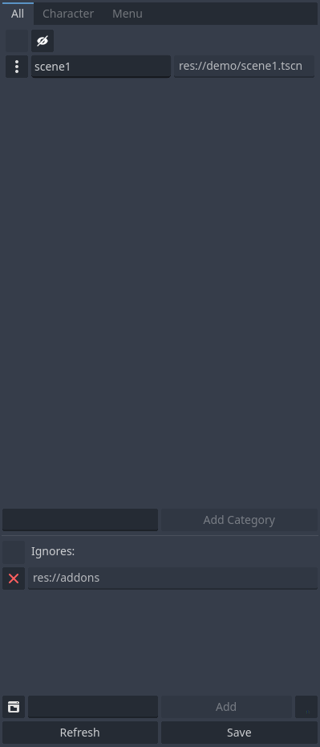

# Scene Manager

<p align="center">

</p>

A tool to manage transition between different scenes.\
Scene Manager v1.X.X and v2.X.X is compatible with Godot 3.\
Scene Manager v3.X.X is compatible with Godot 4.

**Note**: Scene Manager v2.X.X and v1.X.X has heavily less features.

## Features

**Recently Added**:

* [X] Pause and Resume functions added
* [X] Reactive button added which makes the `Scene Manager UI` reactive to changes on `File System` of godot and refreshes the `Scene Manager UI` automatically every time an update happens on files in `res://` location
* [X] Auto Save button added which saves automatically every time a new change found in `Scene Manager UI` + If Reactive is enabled too, after that mechanism, save gets called automatically so that there would be no need to use the save button at all

**All**:

* [X] A fully responsive tool menu structure to manage and categorize your scene
* [X] Save button that saves all scenes in a dictionary
* [X] Refresh button that refreshes the tool with latest saved status of the scenes
* [X] List duplication check for keys
* [X] Smooth transition between scenes
* [X] Ignore folder feature in UI ignores all scenes inside that specific folder that you added in the ignore list
* [X] Categorization for scenes
* [X] Ignore folder section can hide optionally
* [X] Change to previous scenes is possible
* [X] Fully customizable transitions
* [X] Customizable way of entering the first scene of the game
* [X] Reset `Scene Manager` function to assume the current scene as the first ever seen scene (to ignore previous scenes and don't go back to them by changing scene to the previous scene)
* [X] Arrangeable scene categories(they will reset to alphabetic order after refresh or save button pressed)
* [X] Fade in and fade out with different desired patterns
* [X] You can create instance of a scene just by calling the scene with a key
* [X] Transition is so much customizable
* [X] `SceneManager` tool will ignore scenes inside folders with `.gdignore` file beside them
* [X] Loading scenes interactive is possible. (Loading scene code example added)
* [X] Ability to limit how much deep scene manager is allowed to record previous scenes which affects in changing scene to `back`(previous scene) functionality
* [X] Ability to hide scenes in a list (Just Godot4)
* [X] Ignoring a specific scene in ignores list section is possible (Just Godot4)
* [X] sublist in lists of scene manager UI is now possible (Just Godot4)
* [X] `no_effect_change_scene` function added (Just Godot4)
* [X] Node can be added to `change_scene` and `no_effect_change_scene` functions (Just Godot4)
* [X] Possibility to specify path scenes.db via Project/Settings (Just Godot4)
* [X] 5 new signals added:
  * scene_changed
  * fade_in_started
  * fade_out_started
  * fade_in_finished
  * fade_out_finished
* [X] Added a feature to navigate to the scene path in filesystem on godot when clicked on scene address in Scene Manager tool
* [X] Added a feature to open a desired scene from Scene Manager tab
* [X] Users now can have some time to load their scene in the background with the new changing scene functionality

## How To Use?

1. Copy and paste `scene_manager` folder which is inside `addons` folder. (don't change the `scene_manager` folder name)
2. From editor toolbar, choose **`Project > Project Settings...`** then in **`Plugins`** tab, activate scene_manager plugin.
3. Use `Scene Manager` tab on right side of the screen(on default godot theme view) to manage your scenes.
4. After you are done with managing your scenes, always **save** your changes so that your changes have effect inside your actual game.

**Note**: After activating `Scene Manager` tool, you have access to **SceneManager** script globally from anywhere in your scripts and you can use it to change scenes and ... (for more information, read [SceneManager](#scenemanager) section)
**Note**: This tool saves your scenes data inside `res://addons/scene_manager/scenes.gd` file, if you want to have your latest changes and avoid redefining your scene keys, **do not** remove it, **do not** change it or modify it in anyway.

## Tool View

**Note**: All demo pictures and gifs are from Godot4 UI.
This is the tool that you will see on your right side of the godot editor after activating `scene_manager` plugin. By **Add Category** button under scenes categories you can create new categories to manage your scenes.

<p align="center">

</p>

### Double key checker

If editing of a scene key causes at least two keys of another scene match, both of them will get red color and you have to fix the duplication, otherwise the plugin does not work properly as you expect it to work.

<p align="center">

</p>

### Ignore Folder

Every folder that is added inside this section will be ignored and scenes inside them will not get included inside scenes categories section(the section above this section).

<p align="center">

</p>

## Scene Menu

Every scene has a button beside them which will open up a menu to configure settings of that specific scene.

<p align="center">

</p>

## Hide (Just Godot4)

From menu of every scene, you can visible or hide scenes and see just hidden or visible scenes in lists by clicking on eye icon at the top of list categories.

<p align="center">

</p>

## SubList (Just Godot4)

As it is visible on previous pictures, it is possible to add sublists in lists and categorize different scenes in different sublists.

All you have to do is drag scenes by their buttons on the left and drop them on other sublists.

# Demo

Just a simple demo to show some abilities of this addon:

<p align="center">

</p>

## Demo Description

1. Scene \<number\>: this button calls `change_scene` function and goes to next scene.
2. Reset: after pressing this button, you don't go back to the previous seen scenes by pressing back button but if you do, you actually restart your scene.
3. Reload: reloads the current scene.
4. Back: goes back to previous scene. (or restarts if there is no previous scene)
5. Nothing: just shows a transition but actually does nothing.
6. Exit: after fading out of the screen, quits the game.

## Demo Code

**Note**: You can use `SceneManager` node in your game after you activated `scene_manager` plugin.

### Simple Example Without any Loading Screen

```gdscript
extends Button

@export var scene: String
@export var fade_out_speed: float = 1.0
@export var fade_in_speed: float = 1.0
@export var fade_out_pattern: String = "fade"
@export var fade_in_pattern: String = "fade"
@export var fade_out_smoothness = 0.1 # (float, 0, 1)
@export var fade_in_smoothness = 0.1 # (float, 0, 1)
@export var fade_out_inverted: bool = false
@export var fade_in_inverted: bool = false
@export var color: Color = Color(0, 0, 0)
@export var timeout: float = 0.0
@export var clickable: bool = false
@export var add_to_back: bool = true

@onready var fade_out_options = SceneManager.create_options(fade_out_speed, fade_out_pattern, fade_out_smoothness, fade_out_inverted)
@onready var fade_in_options = SceneManager.create_options(fade_in_speed, fade_in_pattern, fade_in_smoothness, fade_in_inverted)
@onready var general_options = SceneManager.create_general_options(color, timeout, clickable, add_to_back)

func _ready() -> void:
 var fade_in_first_scene_options = SceneManager.create_options(1, "fade")
 var first_scene_general_options = SceneManager.create_general_options(Color(0, 0, 0), 1, false)
 SceneManager.show_first_scene(fade_in_first_scene_options, first_scene_general_options)
 # code breaks if scene is not recognizable
 SceneManager.validate_scene(scene)
 # code breaks if pattern is not recognizable
 SceneManager.validate_pattern(fade_out_pattern)
 SceneManager.validate_pattern(fade_in_pattern)

func _on_button_button_up():
 SceneManager.change_scene(scene, fade_out_options, fade_in_options, general_options)

func _on_reset_button_up():
 SceneManager.reset_scene_manager()

func _on_loading_scene_button_up():
 SceneManager.set_recorded_scene(scene)
 SceneManager.change_scene("loading", fade_out_options, fade_in_options, general_options)

func _on_loading_scene_initialization_button_up():
 SceneManager.set_recorded_scene(scene)
 SceneManager.change_scene("loading_with_initialization", fade_out_options, fade_in_options, general_options)

func _on_pause_and_resume_button_up():
 await SceneManager.pause(fade_out_options, general_options)
 await get_tree().create_timer(3).timeout
 await SceneManager.resume(fade_in_options, general_options)
```

### Simple Example With Loading Screen

```gdscript
extends Control

# Nodes
@onready var progress: ProgressBar = find_child("Progress")
@onready var loading: AnimatedSprite2D = find_child("Loading")
@onready var next: Button = find_child("Next")

func _ready():
 SceneManager.load_percent_changed.connect(percent_changed)
 SceneManager.load_finished.connect(loading_finished)
 SceneManager.load_scene_interactive(SceneManager.get_recorded_scene())

func percent_changed(number: int) -> void:
 progress.value = number

func loading_finished() -> void:
 loading.visible = false
 next.visible = true

func _on_next_button_up():
 var fade_out_options = SceneManager.create_options(1.0, "scribbles", 0.2, true)
 var fade_in_options = SceneManager.create_options(1.0, "crooked_tiles", 0.2, true)
 var general_options = SceneManager.create_general_options(Color(0, 0, 0), 0, false, true)
 SceneManager.change_scene_to_loaded_scene(fade_out_options, fade_in_options, general_options)
```

### More Complex Example With Loading Screen for Scenarios That Scenes Need Some Time in Background

#### First Part

**Note**: This example is for someone who needs to generate a world in the background and then show the scene to the user or someone who generally needs to load some data in the background and then show the new scene to the user/player.

```gdscript
extends Control

# Nodes
@onready var progress: ProgressBar = find_child("Progress")
@onready var loading: AnimatedSprite2D = find_child("Loading")
@onready var next: Button = find_child("Next")
@onready var label: Label = find_child("Label")

var gap = 30

func _ready():
 SceneManager.load_percent_changed.connect(percent_changed)
 SceneManager.load_finished.connect(loading_finished)
 SceneManager.load_scene_interactive(SceneManager.get_recorded_scene())

func percent_changed(number: int) -> void:
 # the last `gap%` is for the loaded scene itself to load its own data or initialize or world generate or ...
 progress.value = max(number - gap, 0)
 if progress.value >= 90:
  label.text = "World Generation . . ."

func loading_finished() -> void:
 # All loading processes are finished now
 if progress.value == 100:
  loading.visible = false
  next.visible = true
  label.text = ""
 # Loading finishes and world initialization or world generation or whatever you wanna call it will start
 elif progress.value == 70:
  SceneManager.add_loaded_scene_to_scene_tree()
  gap = 0
  label.text = "Scene Initialization . . ."

func _on_next_button_up():
 var fade_out_options = SceneManager.create_options(1.0, "scribbles", 0.2, true)
 var fade_in_options = SceneManager.create_options(1.0, "crooked_tiles", 0.2, true)
 var general_options = SceneManager.create_general_options(Color(0, 0, 0), 0, false, true)
 SceneManager.change_scene_to_existing_scene_in_scene_tree(fade_out_options, fade_in_options, general_options)
```

#### Second Part

Assume this part is in the new scene which needs some time in the background:

**Note**: This part emits the signal of `load_percent_changed` of SceneManager to inform the loading screen to change the percentage to inform user that something is happening.
**Note**: After the loading process is finished, `load_finished` will be called to inform the loading screen which everything is ready to change to the new scene.

```gdscript
extends Control

var t = Timer.new()
var count = 0

func _ready():
 self.add_child(t)
 t.timeout.connect(_on_timeout)
 t.start(1)

func _on_timeout():
 count += 1
 if count == 1:
  SceneManager.load_percent_changed.emit(80 + randi_range(0, 9))
 elif count == 2:
  SceneManager.load_percent_changed.emit(90 + randi_range(0, 9))
 if count == 3:
  SceneManager.load_percent_changed.emit(100)
  SceneManager.load_finished.emit()
  t.timeout.disconnect(_on_timeout)
 t.start(count + 1)
```

## SceneManager

### Signals

1. load_finished => signal fires when interactively loading a scene finishes
2. load_percent_changed(value: int) => signal fires when interactively loading a scene progress percentage updates
3. scene_changed => signal fires when scene changes
4. fade_in_started => signal fires when fade in starts
5. fade_out_started => signal fires when fade out starts
6. fade_in_finished => signal fires when fade in finishes
7. fade_out_finished => signal fires when fade out finishes

### Methods

This is the node you use inside your game code and it has these functions:

1. `validate_scene`(**key**: String) -> void:
   * Checks and validates passed **key** in scenes keys. (breaks game if key doesn't exist in scenes keys)
2. `validate_pattern`(**key**: String) -> void:
   * Checks and validates passed **key** in patterns keys. (breaks game if key doesn't exist in patterns keys)
3. `safe_validate_scene`(**key**: String) -> bool:
   * Safely validates the scene key and does not break the game.
4. `safe_validate_pattern`(**key**: String) -> bool:
    * Safely validates the pattern key and does not break the game.
5. `change_scene`(**scene**: String or PackedScene or Node, **fade_out_options**: Options, **fade_in_options**: Options, **general_options**: GeneralOptions) -> void:
   * Changes scene if scene is valid, otherwise nothing happens.
   * **fade_out_options** and **fade_in_options** are some configurations you can put in the function to customize your fade_in to the scene or fade_out of the current scene and you can create `Options` objects by calling `create_options` function.
   * **general_options** are common configurations that effect transition in both fade_in and fade_out transitions and you can create `GeneralOptions` by calling `create_general_options` functions.
   * **Note**: `back` as value of scene variable, causes going back to previous scene.
   * **Note**: `null`, `ignore` or an empty string as value of scene variable, causes nothing but just showing scene transition and does not change scenes at all.
   * **Note**: `refresh`, `reload` or `restart` as value of scene variable, causes refreshing the current scene.
   * **Note**: `exit` or `quit` as value of scene variable, causes exiting out of the game.
   * **Note**: Any String value as **scene** variable which starts with an `_` will be ignored.
6. `no_effect_change_scene`(**scene**: String or PackedScene or Node, **hold_timeout**: float = 0.0, **add_to_back**: bool = true) -> void:
   * Changes scene if scene is valid without effects, otherwise nothing happens.
   * **hold_timeout** is the timeout before changing to the scene.
   * **add_to_back** determines if we can go back to this scene or not.
   * **Note**: This method is for advanced users to actually apply their own effects and just change scenes with scene manager.
7. `create_options`(**fade_speed**: float = 1, **fade_pattern**: String = "fade", **smoothness**: float = 0.1, **inverted**: bool = false) -> Options:
   * Creates `Options` object for `change_scene` function.
   * **fade_speed** = speed of fading out of the scene or fading into the scene in seconds.
   * **fade_pattern** = name of a shader pattern which is in `addons/scene_manager/shader_patterns` folder for fading out or fading into the scene. (if you use `fade` or an empty string, it causes a simple fade screen transition)
   * **smoothness** = defines roughness of pattern's edges. (this value is between 0-1 and more near to 1, softer edges and more near to 0, harder edges)
   * **inverted** = inverts the pattern.
8. `create_general_options`(**color**: Color = Color(0, 0, 0), **timeout**: float = 0, **clickable**: bool = true, **add_to_back**: bool = true) -> GeneralOptions:
   * **color** = color for the whole transition.
   * **timeout** = between this scene and next scene, there would be a gap which can take much longer that usual(default is 0) by your choice by changing this option.
   * **clickable** = makes the scene behind the transition visuals clickable or not.
   * **add_to_back** = if true, you can go back to current scene after changing scene to next scene by going to "back" scene which means previous scene.
9. `show_first_scene`(**fade_in_options**: Options, **general_options**: GeneralOptions) -> void:
    * Call this method inside `_ready` function of a node with a script which that node is inside the first scene that game jumps into it and this causes to have a smooth transition into the first game scene.
    * This function works just once at the beginning of the first game scene. After that, if you call this function again, nothing happens.
    * **fade_in_options** = creates it by calling `create_options` function.
    * **general_options** = creates it by calling `create_general_options` function.
10. `reset_scene_manager`() -> void:
    * Sets current active scene as a starting point so that we can't go back to previous scenes with changing scene to `back` scene.
11. `create_scene_instance`(**key**: String) -> Node:
    * Returns scene instance of passed scene key (blocking)
12. `set_back_limit`(**input**: int) -> void:
    * Limits how much deep scene manager is allowed to record previous scenes which affects in changing scene to `back`(previous scene) functionality.
    * Allowed `input` values:
      1. input = -1 => unlimited (default)
      2. input =  0 => we can not go back to any previous scenes
      3. input >  0 => we can go back to `input` or less previous scenes
13. `get_scene`(**key**: String) -> PackedScene:
    * Returns PackedScene of passed scene key (blocking)
14. `load_scene_interactive`(**key**: String) -> void:
    * Loads scene interactive.
    * **Note**: Connect to `load_percent_changed(value: int)` and `load_finished` signals to listen to updates on your scene loading status.
15. `get_loaded_scene`() -> PackedScene:
    * Returns loaded scene.
    * **Note**: If scene is not loaded, blocks and waits until scene is ready. (acts blocking in code and may freeze your game, make sure scene is ready to get)
16. `change_scene_to_loaded_scene`(**fade_out_options**: Options, **fade_in_options**: Options, **general_options**: GeneralOptions) -> void:
    * Changes scene to interactively loaded scene.
    * Checkout function number 5 (`change_scene`) to understand what **fade_out_options**, **fade_in_options** and **general_options** are.
17. `get_previous_scene`() -> String:
    * Returns previous scene. (the scene before current scene)
18. `get_previous_scene_at`(**index**: int) -> String:
    * Returns a specific previous scene at an exact index position
19. `pop_previous_scene`() -> String:
    * Returns previous scene and removes it from list of previous scenes.
20. `previous_scenes_length`() -> int:
    * Returns how many scenes there are in list of previous scenes.
21. `set_recorded_scene`(**key**: String) -> void:
    * Records a scene key to be used for loading scenes to know where to go after getting loaded into loading scene or just for next scene to know where to go next.
22. `get_recorded_scene`() -> String:
    * Returns recorded scene by `set_recorded_scene` function.
23. `add_loaded_scene_to_scene_tree`() -> void:
    * Imports loaded scene into the scene tree but doesn't change the current scene
    * Maily used when your new loaded scene has a loading phase when added to scene tree
    * So to use this, first has to call `load_scene_interactive` to load your scene and then have to listen on `load_finished` signal and after the signal emits, you call this function and this function adds the loaded scene to the scene tree but exactly behind the current scene so that you still can not see the new scene
24. `change_scene_to_existing_scene_in_scene_tree`(**fade_out_options**: Options, **fade_in_options**: Options, **general_options**: GeneralOptions) -> void:
    * When you added the loaded scene to the scene tree by `add_loaded_scene_to_scene_tree` function, you call this function after you are sure that the added scene to scene tree is completely ready and functional to change the active scene
25. `pause`(**fade_out_options**: Options, **general_options**: GeneralOptions) -> void:
    * Just executes the fade out animation.
    * Use it with `resume` function when you need to do something but do not want the player to see it.
26. `resume`(**fade_in_options**: Options, **general_options**: GeneralOptions) -> void:
    * Just executes the fade in animation.
    * Use it with `pause` function when you need to do something but do not want the player to see it.
